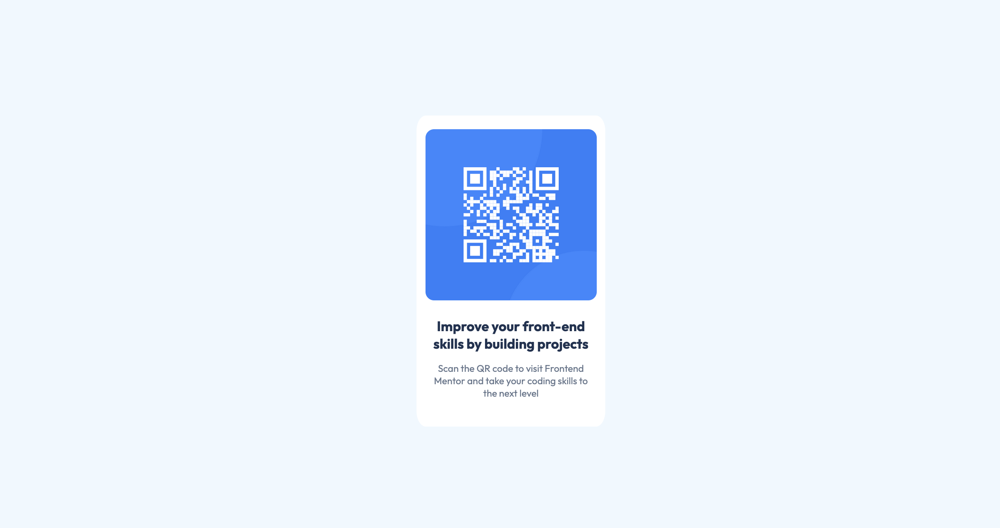

# Frontend Mentor - QR code component solution

This is a solution to the [QR code component challenge on Frontend Mentor](https://www.frontendmentor.io/challenges/qr-code-component-iux_sIO_H). Frontend Mentor challenges help you improve your coding skills by building realistic projects. 

## Table of contents

- [Overview](#overview)
  - [Screenshot](#screenshot)
  - [Links](#links)
- [My process](#my-process)
  - [Built with](#built-with)
  - [What I learned](#what-i-learned)
- [Author](#author)


**Note: Delete this note and update the table of contents based on what sections you keep.**

## Overview
Build a customizable QR code component that closely matches a provided design mockup. Use any tools or libraries to generate and style the QR code, ensuring it’s visually accurate, responsive, and reusable. Focus on attention to detail to create a polished, pixel-perfect implementation.
### Screenshot




### Links

- Solution URL: [Github solution](https://your-solution-url.com)
- Live Site URL: [Website Live](https://your-live-site-url.com)

## My process

### Built with

- Semantic HTML5 markup
- CSS custom properties
- Flexbox
- CSS Grid
- Mobile-first workflow

### What I learned

Create the HTML Structure: Wrap the generated QR code image inside a container <div> for styling purposes.

Style with CSS:

- Set the container's size, padding, and background to match the design.
- Apply styles to position overlay elements or decorative borders.
- Use CSS properties like border-radius and background-color to customize appearance.

See some code snippets, see below:

```css
.main-card{
  background-color: var(--White);
  width: 200px;
  padding: 1rem 0.65rem;
  border-radius: 5%;
}
```

## Author

- Frontend Mentor - [@gwencoding](https://www.frontendmentor.io/profile/gwencoding)


