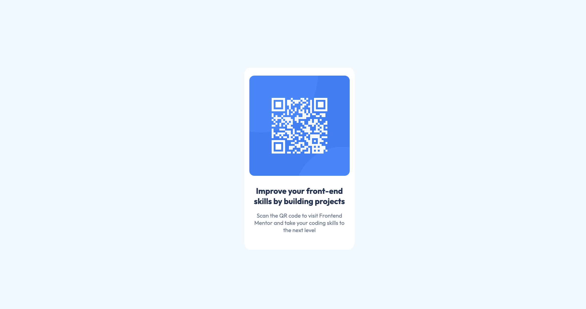

# Frontend Mentor - QR code component solution

 

This is a solution to the [QR code component challenge on Frontend Mentor](https://www.frontendmentor.io/challenges/qr-code-component-iux_sIO_H). Frontend Mentor challenges help you improve your coding skills by building realistic projects. 

## Table of contents

- [Overview](#overview)
  - [Screenshot](#screenshot)
  - [Links](#links)
- [My process](#my-process)
  - [Built with](#built-with)
- [Author](#author)

## Overview
Build a customizable QR code component that closely matches a provided design mockup. Use any tools or libraries to generate and style the QR code, ensuring it’s visually accurate, responsive, and reusable. Focus on attention to detail to create a polished, pixel-perfect implementation.
### Screenshot

### Links

- Solution URL: [Github solution](https://github.com/gwencoding/qr-code-component-main)
- Live Site URL: [Website Live](https://qr-code-component-gc.netlify.app)

## My process

### Built with

- Semantic HTML5 markup
- CSS custom properties
- Flexbox
- CSS Grid
- Mobile-first workflow

## Author

- Frontend Mentor - [@gwencoding](https://www.frontendmentor.io/profile/gwencoding)

